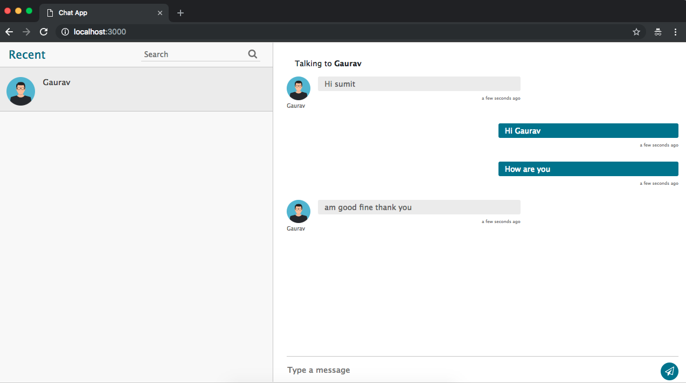
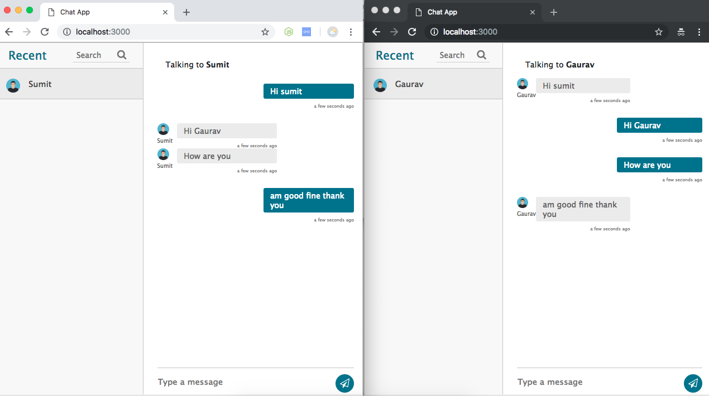

# Anouncments

WE ARE PLANING TO MAKE IT LIKE SLACK SO ORGANIZATIONS CAN USE IT FOR FREE. PLEASE FEEL FREE TO ADD THE COMMENTS OR SUGGESTIONS IN SHEET BELOW.

https://docs.google.com/spreadsheets/d/1bBQ3pgr1LPDse0DKMzZptd2H41K-I91R545nmYdMhTY/edit?usp=sharing

# node-chat-one-to-one
Node socket.io based one to one chat.

## Features
 1. One to one chat 
 2. Chat Rooms
 3. Individual login using passport.
 4. Bootstrap 4 UI
 5. Seperate UI, so you can skin as you want.
 6. Developed with Express.js, EJS, Socket.io

### Simple interface for the window, very similar to linkedin.

### Realtime chatting 

## ToDO List
 1. Block or Ignore user
 2. Make more skins.
 3. Admin panel, so admin can make chat rooms.
 4. Responsive design
 5. Log out (Important)
 6. Refresh list when someone is conected (Important)
 7. One to one chat ?
 8. Is writing...
 9. No internet
 10. Statics users (Important)
 11. Save chats (Important)
 12. Responsive -> Header and footer -> maybe 2 views: 1) Contacts. 2) Chat
 13. Room chats

## On Demand feature?
 looking for some custom feature with this script, feel free to open an issue at github, with feature request.

## License
 It comes with MIT license, means you can use it as you want.

## Special thanks
1. Sumit rajput, for making beautiful ui for chat screen. 

## Notation - Think about this!

Database -> Cassandra or HBase ?
-Cassandra = Columnas -> E-commerce, Deteccion de fraudes, Analisis en tiempo real -> Crecimiento de datos exponencial y tenemos la estructura de la bd
-Mongo DB = Documentos -> Analisis en tiempo real, aplicaciones moviles -> si no tenemos una estructura fija

Backend -> Connection with API Rest made it in net core?

Authentication -> Google? 

Username-IdUsername(celphone or email with authentication) (Important)
User{
    Id int PK
    Username string
    State State
    Cel string 
    Email string 
    LastConnection DateTime
}
Message{
    Id int PK
    Description string
    From int FK
    To int FK
    Sent bool
    SentDate DateTime
    Received bool
    ReceivedDate Datetime 
    Read bool
    ReadDate Datetime
}
State{
    -> Active / Absent / Not available
}
